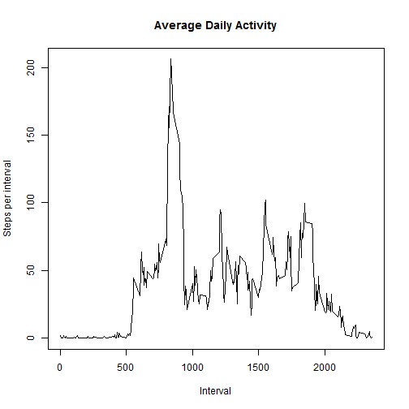

# Reproducible Research: Peer Assessment 1


## Loading and preprocessing the data
Set working directory and get data if necessary.

```r
if (basename(getwd())!="RepData_PeerAssessment1") 
    setwd("~/GitHub/RepData_PeerAssessment1")
if (!file.exists("activity.zip")) download.file(
    "http://d396qusza40orc.cloudfront.net/repdata%2Fdata%2Factivity.zip",
    destfile="activity.zip")
if (!file.exists("activity.csv")) unzip("activity.zip")
```

Load data, remove NA values, and format date.

```r
alldata<-read.csv("activity.csv")
alldata$date<-as.Date(alldata$date,format="%Y-%m-%d")
data<-alldata[!is.na(alldata[,"steps"]),]
```


## What is mean total number of steps taken per day?

Calculate daily totals.

```r
daytotals<-tapply(data$steps,data$date,sum)
```

Mean and median.

```r
mean(daytotals)
```

```
## [1] 10766
```

```r
median(daytotals)
```

```
## [1] 10765
```

A histogram of daily totals.

```r
hist(daytotals, xlab="Total Steps per Day",main="Totals Steps per Day",col="red")
```

 

## What is the average daily activity pattern?

Calculate averages for each 5-minute period.

```r
intervalaverages<-tapply(data$steps,data$interval,mean)
intervals<-as.integer(names(intervalaverages))
```

Plot average daily activity.

```r
plot(intervals,intervalaverages,type="l",xlab="Interval",ylab="Steps per interval",
     main="Average Daily Activity")
```

 

Interval with maximum average number of steps, and the average number of steps for
that interval.

```r
intervalaverages[which.max(intervalaverages)]
```

```
##   835 
## 206.2
```

## Imputing missing values
Number of missing (NA) values.

```r
sum(is.na(alldata$steps))
```

```
## [1] 2304
```

Replace all NA values with the average value for that interval averaged across all days.

```r
data2<-alldata
naloc<-which(is.na(data2$steps))
iidx<-match(data2$interval[naloc],intervals)
data2$steps[naloc]<-intervalaverages[iidx]
```

Calculate daily totals with the updated data.

```r
daytotals2<-tapply(data2$steps,data2$date,sum)
```

Mean and median of day total number of steps using the updated data.

```r
mean(daytotals2)
```

```
## [1] 10766
```

```r
median(daytotals2)
```

```
## [1] 10766
```

A histogram of daily totals, with estimated values for missing data.

```r
hist(daytotals2, xlab="Total Steps per Day",main="Totals Steps per Day",col="red")
```

 

With the updated data there is only a slight increase in median total daily number of steps.  The histogram shows more days with close to the average number of steps.

## Are there differences in activity patterns between weekdays and weekends?

Subset data for weekday and weekend and compute averages.

```r
weekend<-data2[(weekdays(data2$date) %in% c("Saturday","Sunday")),]
weekday<-data2[(weekdays(data2$date) %in% c("Monday","Tuesday","Wednesday","Thursday","Friday")),]
weekendavg<-tapply(weekend$steps,weekend$interval,mean)
weekdayavg<-tapply(weekday$steps,weekday$interval,mean)
weekendintervals<-as.integer(names(weekendavg))
weekdayintervals<-as.integer(names(weekdayavg))
```

Plot weekend and weekday activity.

```r
par(mfrow=c(2,1))
plot(weekendintervals,weekendavg,type="l",
     xlab="Interval",ylab="Steps per interval", 
     main="Weekend Activity")
plot(weekdayintervals,weekdayavg,type="l",
     xlab="Interval",ylab="Steps per interval", 
     main="Weekday Activity")
```

 

